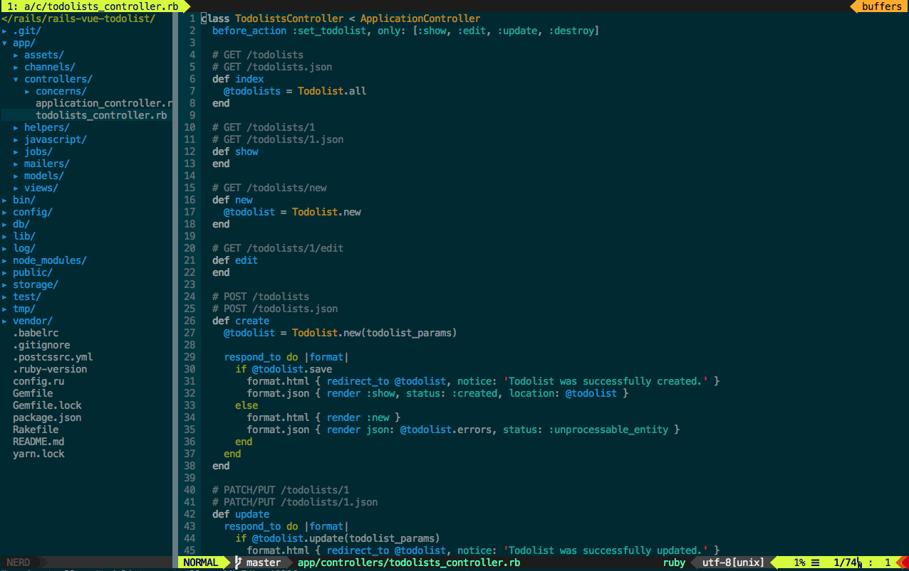

# Nic's dotfile

Vim



Tmux


## 安裝說明

#### Step 1
```
cd
git clone git@github.com:niclin/dotfile.git
cd dotfiles
rake install
```

Install 後會將原本的檔案先進行備份，在目錄下可以透過 .dotfiles_backup 下找到，在自行 Combine 你的 alias 等設定進來就可以，無須擔心自己的設定被覆蓋。

#### Step2

open `vim`

key in the word to pepare install plugin

`:PluginInstall`

wait a second be installment

## 相關依賴

#### Fonts

裝有 Powerline 的字體，如果 command line 用 iTerm 也別忘記修改，否則會出現一堆 `?`

我個人都用 `Menlo for Powerline` + `Inconsolata-dz-Powerline`

這兩個字體可以讓 tmux + VIM 的一些特殊符號都正常顯示，我放在本專案的 fonts 底下了

#### Dependence

Mac 下必須要安裝相關依賴

##### 搜尋神器
`brew install the_silver_searcher`

##### tmux 的複製貼上
`brew install reattach-to-user-namespace`

##### 在 tmux 中顯示 cpu/memory 實時使用量
`brew install tmux-mem-cpu-load`

## 使用說明

- Vim perfix <kbd>,</kbd>
- Tmux perfix <kbd>`</kbd>

#### Vim

- AG 全域搜尋： <kbd>,</kbd> + <kbd>a</kbd>
- NERDTree 樹狀結構：<kbd>,</kbd> + <kbd>d</kbd>
- 檔案搜尋：<kbd>,</kbd> + <kbd>t</kbd>
- ESC：<kbd>,</kbd> + <kbd>,</kbd> (快速雙擊兩下逗號)


#### Tmux

- 視窗垂直切割：<kbd>`</kbd> + <kbd>|</kbd>
- 視窗水平切割：<kbd>`</kbd> + <kbd>-</kbd>
- 切到上一個 window：<kbd>`</kbd> + <kbd>`</kbd> (快速雙擊兩下 `)


#### 安裝新版的 vim

```
brew install vim --with-override-system-vi
```


#### Iterm2 設定

1. 把字體調成 14
2. 字體選擇 menlo for powerline
3. 設定游標閃爍 Preferences -> Profiles -> 將 Blinking cursor 打勾


#### TODO

- 確認把 color/ 和 plugin/settings 移到 vim 底下，如果新機器沒有要幫他建立資料夾
- 修復 tmux 底下導航字體存在 github 問題
